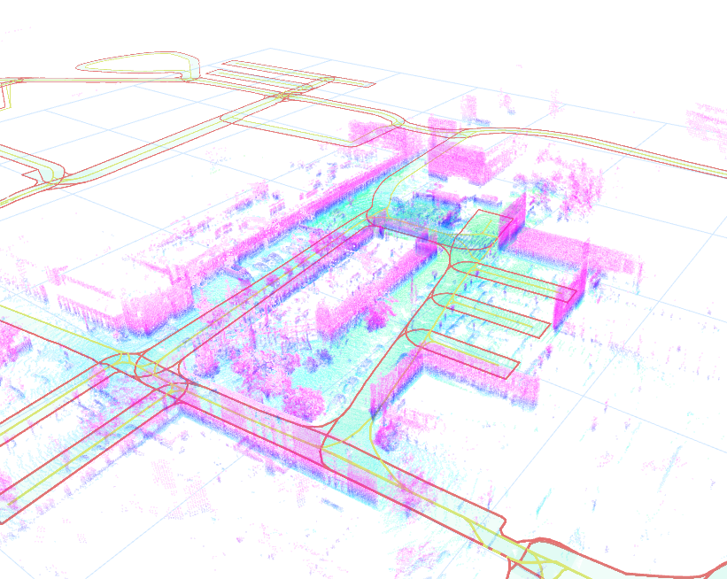

# `lanelet2_rviz2` ROS2 package - OSMVisualizer

**OSMVisualizer** is a ROS 2 node for visualizing OpenStreetMap (OSM) data in RViz2. It processes `.osm` files specified via launch parameters and publishes markers for map elements, such as nodes, ways, and relations.

[](https://docs.ros.org/en/humble/)
[](https://docs.ros.org/en/jazzy/)

## Features
- **Static File Loading**: Reads the `.osm` filename from a launch file parameter (`osm_filename`).
- **Advanced Visualization in RViz2**:
  - Displays map relations as colored line strips:
    - Left ways are shown in **lime**.
    - Right ways are shown in **red**.
  - Relation areas are filled using **polygon triangulation**.
  - Speed limits are visualized with a **gradient color scale**:
    - Green for lower speeds.
    - Blue for medium speeds.
    - Red for higher speeds.
  - One-way relations are marked with dynamically positioned **direction arrows**.
- **Dynamic Parameter Reconfiguration**: Modify visualization settings like `line_width`, `frame_id`, or `speed_color_max` during runtime without restarting the node.
- **Reusable Data Structures**: Efficiently processes nodes, ways, and relations.



## Topics

### Published
- `/osm_relations` (visualization_msgs/msg/MarkerArray):
  Marker array for relations (left and right ways).
- `/osm_speed` (visualization_msgs/msg/MarkerArray):
  Marker array for relation areas, visualized with speed gradient colors.
- `/osm_one_way_arrows` (visualization_msgs/msg/MarkerArray):
  Marker array for one-way direction arrows.

## Parameters

### Node Parameters
- `osm_filename` (string): Path to the `.osm` file to process.
- `frame_id` (string): The coordinate frame for visualization markers (default: `"map_gyor_0"`).
- `line_width` (double): Width of the visualization lines (default: `0.8`).
- `center_map` (bool): Center the map in RViz2 (default: `false`).
- `speed_color_max` (double): Maximum speed limit for gradient visualization (default: `90.0`).

## Usage

### 1. Build the Project
Make sure your ROS 2 workspace is set up. Clone this repository into the `src` directory and build it:

```bash
cd ~/ros2_ws/src && git clone https://github.com/jkk-research/lanelet2_rviz2
```

```bash
cd ~/ros2_ws && colcon build --packages-select lanelet2_rviz2 --symlink-install
```

```bash
source ~/ros2_ws/install/setup.bash
```

### 2. Run the Node
Launch the `OSMVisualizer` node with a launch file specifying the `.osm` filename:

```bash
ros2 launch lanelet2_rviz2 visualize_osm.launch.py
```

```bash
ros2 run lanelet2_rviz2 visualize_osm --ros-args -p osm_filename:=/mnt/c/map/lanelet.osm -p frame_id:=map
```


### 3. Visualize in RViz2
- Open RViz2:
  ```bash
  rviz2
  ```
- Add a `MarkerArray` display.
- Set the topics to:
  - `/osm_relations` for line strips representing left and right ways.
  - `/osm_speed` for filled relation areas with speed gradient.
  - `/osm_one_way_arrows` for direction arrows.

### 4. Dynamic Parameter Updates
Update visualization parameters during runtime using the `ros2 param set` command. Example:

```bash
ros2 param set /osm_visualizer line_width 1.5
```

Or with `rqt_reconfigure`:

```bash
ros2 run rqt_reconfigure rqt_reconfigure
```

## Usage with Pointcloud

```bash
sudo apt install ros-$ROS_DISTRO-pcl-ros
```

```bash
ros2 run pcl_ros pcd_to_pointcloud --ros-args -p file_name:=/home/he/dlio_map2.pcd -p tf_frame:=map_gyor_0 -p publishing_period_ms:=500 --qos-reliability best_effort
```

## Acknowledgments
- **[RapidXML](https://rapidxml.sourceforge.net/)** is used for parsing the OSM files.
- **[Earcut](https://github.com/mapbox/earcut.hpp)** is used for polygon triangulation, enabling visualization of filled areas in RViz2.
